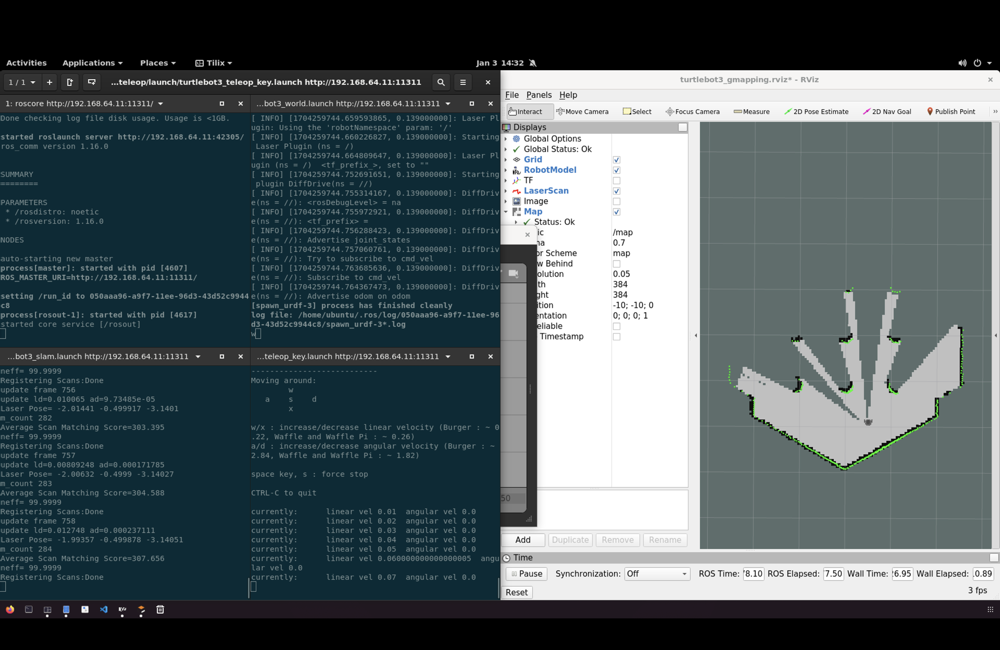

### TurtleBot Control

```bash
$ roslaunch turtlebot3_teleop turtlebot3_teleop_key.launch
```

### Run ROS Simulate

```bash
$ roslaunch turtlebot3_gazebo turtlebot3_world.launch
```

### Run SLAM Mode

```bash
$ roslaunch turtlebot3_slam turtlebot3_slam.launch slam_methods:=gmapping
```



라이다?
